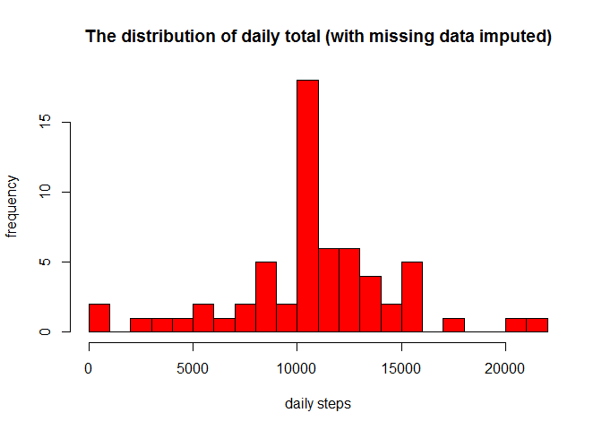
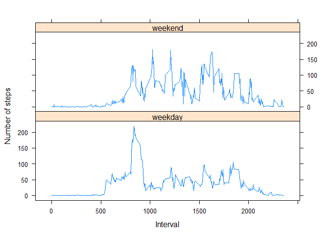

# Reproducible Research: Course Project 1


## 1. Loading and preprocessing the data

For this assignment, the first step is to load the data file "activity.csv" by read.csv

In loading the data for the project, I use the read.csv() function to read in the designated csv file. I used the str() function to determine the class types of the data.

For this assignment, the first step is to load the data file "activity.csv" by read.csv

In loading the data for the project, I use the read.csv() function to read in the designated csv file. I used the str() function to determine the class types of the data.


```r
cls = c("integer", "character", "integer")
df <- read.csv("activity.csv", head=TRUE, colClasses=cls, na.strings="NA")
head(df)
```

```
##   steps       date interval
## 1    NA 2012-10-01        0
## 2    NA 2012-10-01        5
## 3    NA 2012-10-01       10
## 4    NA 2012-10-01       15
## 5    NA 2012-10-01       20
## 6    NA 2012-10-01       25
```

Next step is to process/transform the data set for later analysis. Specifically, the type of date column is corrected, we also get rid of rows containing missing values and save the subset to a new data frame "df_ign". The original data frame is kept for later data imputation.


```r
df$date <- as.Date(df$date)
df_ign <- subset(df, !is.na(df$steps))
```

## 2. What is mean total number of steps taken per day?

Next, a histogram of the daily total number of steps taken is generated, showing the distribution of these totals.


```r
dailysum <- tapply(df_ign$steps, df_ign$date, sum, na.rm=TRUE, simplify=T)
dailysum <- dailysum[!is.na(dailysum)]

hist(x=dailysum,
     col="red",
     breaks=20,
     xlab="Daily total steps",
     ylab="Frequency",
     main="The distribution of daily total (missing data ignored)")
```

 


Next, calculate and report the mean and median total number of steps taken per day.


```r
mean(dailysum)
```

```
## [1] 10766.19
```


```r
median(dailysum)
```

```
## [1] 10765
```

So the mean is 10766 steps and the median is 10765 steps.


## 3. What is the average daily activity pattern?

To exam the average daily activity pattern, we create a time series plot (i.e. type = "l") of the 5-minute interval (x-axis) and the average number of steps taken, averaged across all days (y-axis).


```r
int_avg <- tapply(df_ign$steps, df_ign$interval, mean, na.rm=TRUE, simplify=T)
df_ia <- data.frame(interval=as.integer(names(int_avg)), avg=int_avg)

with(df_ia,
     plot(interval,
          avg,
          type="l",
          xlab="5-minute intervals",
          ylab="average steps in the interval across all days"))
```

 

Next is to check which 5-minute interval, on average across all the days in the dataset, contains the maximum number of steps:


```r
max_steps <- max(df_ia$avg)
df_ia[df_ia$avg == max_steps, ]
```

```
##     interval      avg
## 835      835 206.1698
```

It turns out that the interval 835 contains maximum number of steps 206 .

## 4. Imputing missing values

First, we calculate and report the total number of missing values in the dataset (i.e. the total number of rows with NAs):


```r
sum(is.na(df$steps))
```

```
## [1] 2304
```

So the original data set has 2304 rows with missing data.

We use a simple strategy for filling in all of the missing values in the dataset. If a 5-minute interval has missing value, we use the mean for that 5-minute interval.

We create a new data frame df_impute that is equal to the original dataset but with the missing data filled in (using mean for that interval for imputation):


```r
df_impute <- df
ndx <- is.na(df_impute$steps)
int_avg <- tapply(df_ign$steps, df_ign$interval, mean, na.rm=TRUE, simplify=T)
df_impute$steps[ndx] <- int_avg[as.character(df_impute$interval[ndx])]
```

Make a histogram of the total number of steps taken each day and calculate and report the mean and median total number of steps taken per day.


```r
new_dailysum <- tapply(df_impute$steps, df_impute$date, sum, na.rm=TRUE, simplify=T)

hist(x=new_dailysum,
     col="red",
     breaks=20,
     xlab="daily steps",
     ylab="frequency",
     main="The distribution of daily total (with missing data imputed)")
```

 


```r
mean(new_dailysum)
```

```
## [1] 10766.19
```


```r
median(new_dailysum)
```

```
## [1] 10766.19
```

Based on the imputed data set, the new mean is 10766 and the new median is 10766 . Compare with the original mean 10766 and median 10765 , the mean doesn't change, and the median has a small change. In fact, the new median becomes identical to the mean. One possible explanation is that when we fill the missing data for the intervals, we use means for intervals, so we have more data close or identical to the means, and median is shifted and becomes identical to the mean.

The impact of imputing missing data on the estimates of the total daily number of steps is also clear: now we have higher frquency counts in the histogram at the center region (close to the mean).

## 5. Are there differences in activity patterns between weekdays and weekends?

First we create a new factor variable "wk" in the dataset with two levels - "weekday" and "weekend" indicating whether a given date is a weekday or weekend day.


```r
is_weekday <- function(d) {
    wd <- weekdays(d)
    ifelse (wd == "sábado" | wd == "domingo", "weekend", "weekday")
}

wx <- sapply(df_impute$date, is_weekday)
df_impute$wk <- as.factor(wx)
head(df_impute)
```

```
##       steps       date interval      wk
## 1 1.7169811 2012-10-01        0 weekday
## 2 0.3396226 2012-10-01        5 weekday
## 3 0.1320755 2012-10-01       10 weekday
## 4 0.1509434 2012-10-01       15 weekday
## 5 0.0754717 2012-10-01       20 weekday
## 6 2.0943396 2012-10-01       25 weekday
```

Next we make a panel plot containing a time series plot (i.e. type = "l") of the 5-minute interval (x-axis) and the average number of steps taken, averaged across all weekday days or weekend days (y-axis).


```r
wk_df <- aggregate(steps ~ wk+interval, data=df_impute, FUN=mean)

library(lattice)
xyplot(steps ~ interval | factor(wk),
       layout = c(1, 2),
       xlab="Interval",
       ylab="Number of steps",
       type="l",
       lty=1,
       data=wk_df)
```

 

From the panel plot it looks like the weekday activities arise earlier than the weekends - weekday activities arise around 5~6am and weekend activities arise around 8am. We can also observe that from 10am to 5pm, the weekends have higher activity levels than the weekdays.
